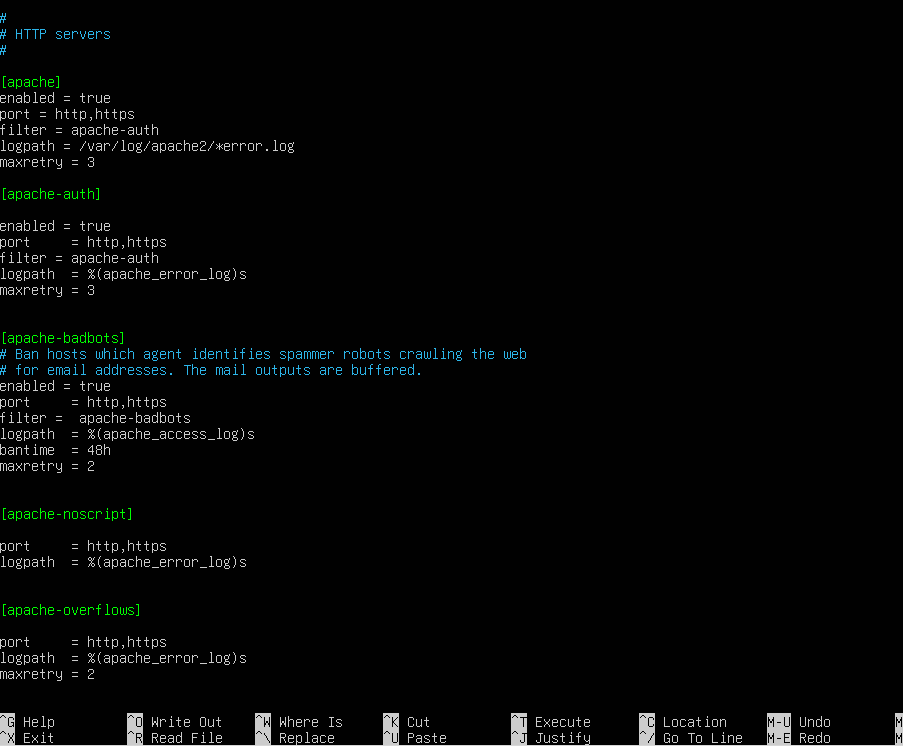
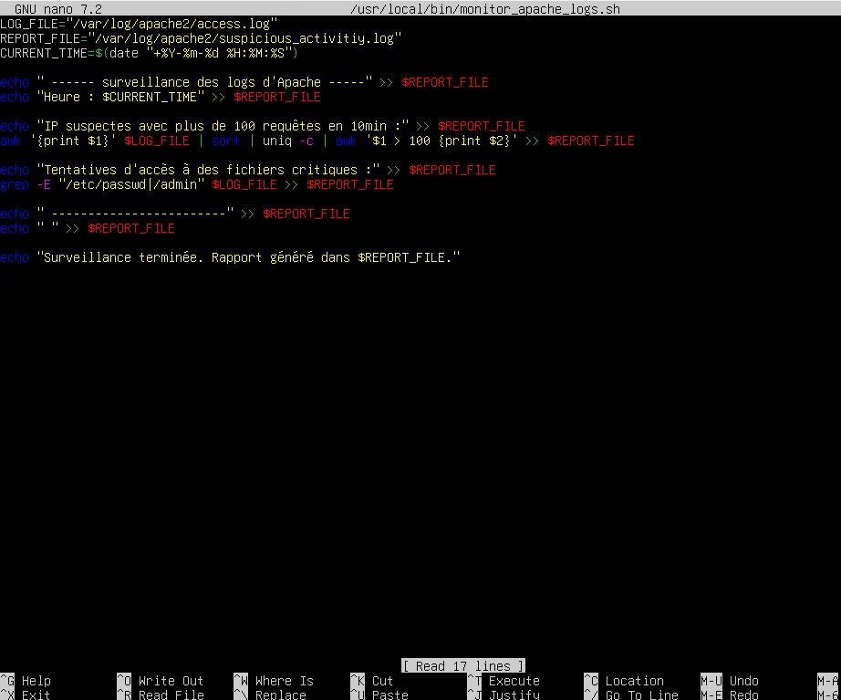
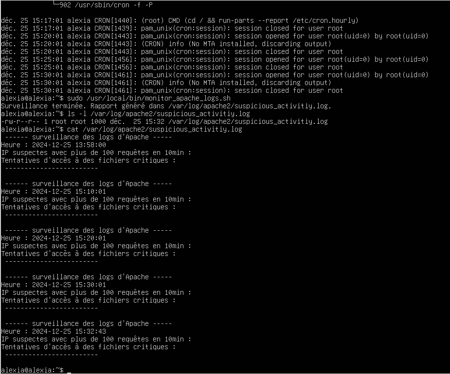
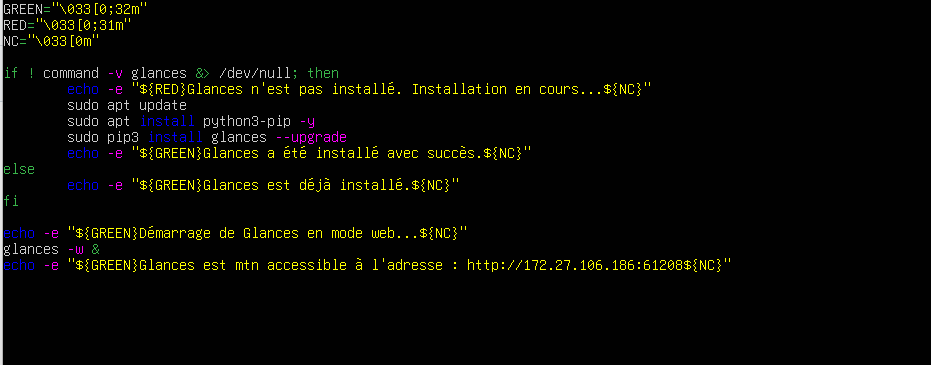
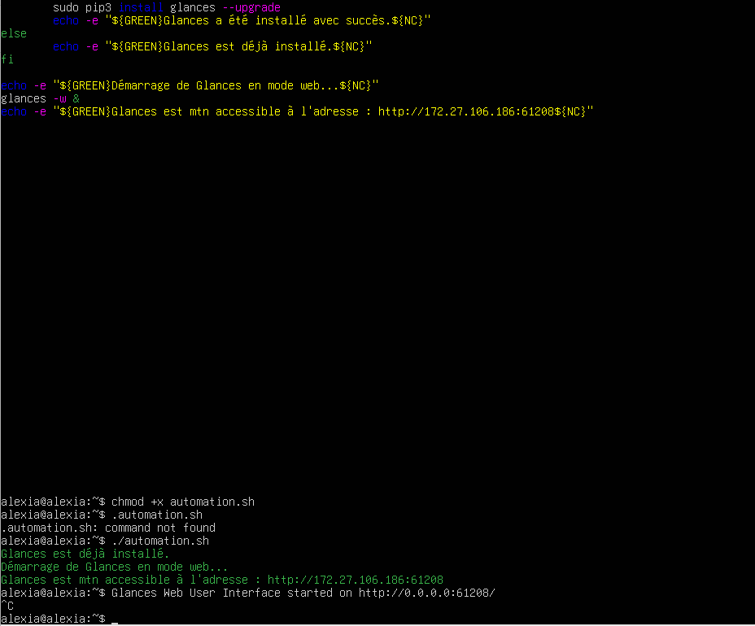

# ScriptAutomatisationGestionServeurs
Le but est de déployer un serveur Apache, Configurer des services comme fail2ban et automatiser certaines tâches comme le monitoring des logs


## 1. Configuration Réseau du Serveur

### Objectif  
Configurer une connexion réseau fonctionnelle pour accéder à Internet depuis la VM.

### Étapes Réalisées  

#### 1.1. Démarrage de la VM
- La VM a été configurée sur **Hyper-V** avec un commutateur réseau externe pour permettre l'accès au réseau.

#### 1.2. Vérification des interfaces réseau  
- Commande utilisée pour afficher les interfaces réseau et vérifier l'état de la connexion :  
  ```bash
  ip a
Résultat : Une adresse IP 172.27.106.186/20 a été attribuée à l'interface réseau eth0

#### 1.3. Vérification des routes réseau
- Commande utilisée
  ```bash
  ip r
#### Test de Connectivité
- Test de communication avec la passerelle
- A Internet via une adresse Ip
- Test de la résolution DNS
  ```bash
  ping -c 172.27.96.1
  ping -c 4 8.8.8.8
  ping -c 4 google.com


## 2. Installation du Serveur Apache

### Objectif  
Installer et configurer le serveur web Apache pour héberger une page web simple.

### Étapes Réalisées  

#### 2.1. Mise à jour des dépôts 
  ```bash
  sudo apt update
 ```
#### 2.2 Installation d'Apache
  ```bash
  sudo apt install apache2 -y
 ```
#### 2.3 Vérification du service 
  ```bash
  sudo systemctl status apache2
 ```
Si le service n'est pas actif alors il faut le démarrer avec : sudo systemctl start apache2
#### Test de l'accès via le naviigateur 
Ouvrir un navigateur web et entrer l'adresse IP du serveur (par exemple : http://172.27.106.186). Si Apache est installé correctement, la page d'accueil d'Apache s'affichera.


## 3. Installation et Configuration de Fail2ban

### Objectif  
Renforcer la sécurité du serveur en installant et configurant Fail2ban pour protéger contre les attaques par force brute.

### Étapes Réalisées  

#### 3.1. Installation de Fail2ban
  ```bash
  sudo apt update
  sudo apt install fail2ban -y
 ```
#### 3.2 Vérification du service
  ```bash
  sudo systemctl status fail2ban
 ```
#### 3.3 Activation du service pour démarrage automatique au boot
  ```bash
  sudo systemctl enable fail2ban
 ```
#### 3.4 Configuration de Fail2ban pour Apache
  ```bash
  sudo cp /etc/fail2ban/jail.conf /etc/fail2ban/jail.local
 ```
#### 3.5 Modification du fichier /etc/fail2ban/jail.local pour activer les filtres de sécurité pour Apache :
  ```bash
  sudo nano /etc/fail2ban/jail.local
 ```


Ici on a modifié les filtres apache-auth et apache-badbots. Le premier pour les tentatives d'authentification échouées et le deuxième pour bloquer les tentatives d'accès à des pages inexistantes ( souvent utilisées pour scanner des vulnérabilités ).
#### 3.6 Redémarrage du service Fail2ban pour appliquer les modifications :
  ```bash
  sudo systemctl restart fail2ban
 ```
#### 3.7 Vérification :
  ```bash
  sudo fail2ban-client status apache-auth
  sudo fail2ban-client status apache-badbots
  sudo fail2ban-client status apache-404
 ```
#### 3.8 Vérification des logs de Fail2ban :
  ```bash
sudo tail -f /var/log/fail2ban.log
 ```


## 4. Automatisation de Tâches avec des Scripts

### Objectif  
Simplifier la gestion du serveur en automatisant certaines tâches courantes. Notamment pour :
- Surveiller les logs d’Apache (détecter des tentatives d’accès suspectes).
- Créer une tâche cron qui exécute ce script régulièrement.
- Générer des alertes ou logs personnalisés en cas de détection d’activité anormale.

### Étapes Réalisées  

#### 4.1. Le Script 
On crée le fichier monitor_apache_logs.sh dans /usr/local/bin 
  ```bash
  sudo nano /usr/local/bin/monitor_apache_logs.sh
 ```
- Puis on exécute ce code pour : placer les logs dans un fichier, filtrer les IPs qui effectuent plis de 100 requêtes en 10min et vérifier les tentatives d'accès à des fichiers critiques.

- Par la suite on va rendre exécutable le script et l'exécuter
```bash
  sudo chmod +x /usr/local/bin/monitor_apache_logs.sh
  sudo /usr/local/bin/monitor_apache_logs.sh
 ```

#### 4.2 Ajouter une tâche Cron 
Notre objectif maintenant est d'exécuter le script automatiquement toutes les 10min :
  ```bash
  sudo crontab -e
  */10 * * * * /usr/local/bin/monitor_apache_logs.sh
 ```
#### 4.3 Vérification du script  
Pour voir si le script a bien fonctionner, on va afficher son contenu :
  ```bash
  cat /var/log/apache2/suspicious_activity.log
 ```


Ici on peut voir que le script à bien fonctionner ! 


## 5. Ajout d'une alerte par e-mail

### Objectif  
Envoie d'une alerte par mail en cas de détéction d'activités suspectes.

### Étapes Réalisées  

#### 5.1. Installation d'un serveur de messagerie local
  ```bash
  sudo apt update
  sudo apt install mailutils

 ```
#### 5.2 Test
  ```bash
  echo "testestest" | mail -s "Test de mailutils" tonadresseemail@example.com
 ```

Mince ! Petit soucis le mail ne s'envoie pas. On va installer un utlitaire SMTP et le configurer

```bash
  sudo apt install msmtp msmtp-mta
  sudo nano /etc/msmtprc
 ```
On va donc le configurer comme ça : 
```bash
account default
host smtp.gmail.com
port 587
auth on
user tonemail@example.com
password tonmotdepasse
tls on
tls_trust_file /etc/ssl/certs/ca-certificates.crt
logfile /var/log/msmtp.log
 ```
Et on applique les permissions : 
```bash
  sudo chmod 600 /etc/msmtprc
 ```


## 6. Utilisation d'un outil de monitoring

### Objectif  
Mettre en place un outil de monitoring pour visualiser en temps réel les performances du serveur.

### Étapes Réalisées  

#### 6.1. Installation de Glances
  ```bash
  sudo apt update
  sudo apt install glances -y
 ```
#### 6.2 Configuration

Modifier le fichier pour permettre l'accès à distance
  ```bash
  sudo nano /etc/glances/glances.conf
 ```
On y rajoute :
  ```bash
    bind = 0.0.0.0
    port = 61208
   ```
On accède à l'interface web :
```bash
  glances -w
 ```
```bash
  [glances -w](http://<adresse_IP_du_serveur>:61208)
 ```




